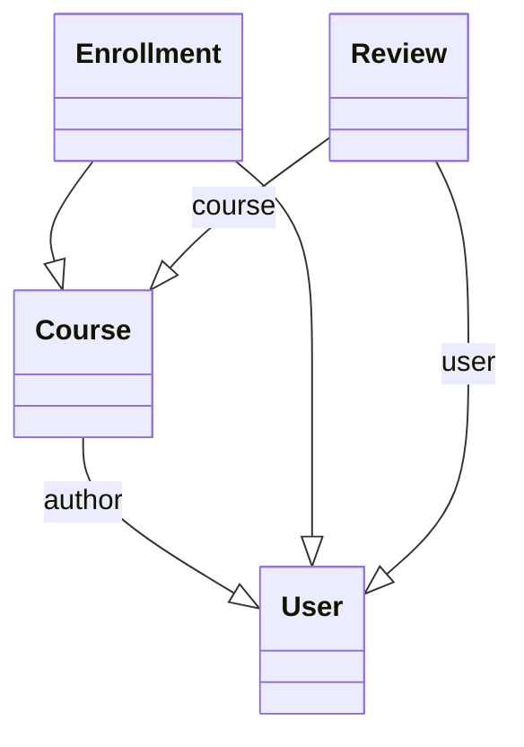

Projekt Aleksandria
===================
podpowiedzi copilot
python manage.py test
coverage run manage.py test
coverage report
coverage html
start htmlcov/index.html
nice interface python -m install ipython
python manage.py shell

Simple project to register users on courses

